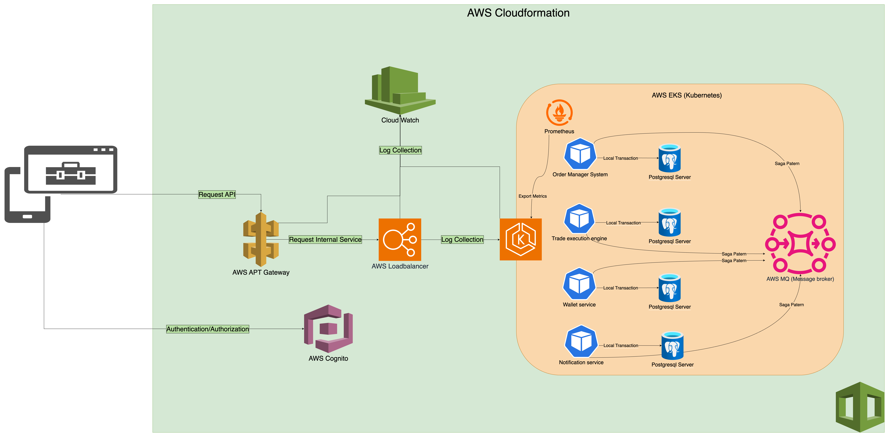

### Trading system features

#### Authentication / Authorization

- User must be authenticated to use our trading platform
- Authentication can be SSO (google, facebook, github, ...) or our local provider.
- User must be authorization before access to app features

#### P2P exchange

- User can place order, it can be save or buy
- User can action with order: Buy a sell order or Sell a buy order

#### Trade crypto

- Market Order: Buy or sell immediately at the current market price.
- Limit Order: Set a specific price at which you want to buy or sell. The order will be executed when the market reaches your specified price.
- Stop-Limit Order: Set a stop price and a limit price. When the stop price is reached, a limit order is placed.

### Architecture Overview

#### Details and Role

#### Note: This is top down explain, i will go from user-side (mobile or web) to smallest our infrastructure unit

1. On the user side (mobile or web application) make request to **AWS Cognito**.
2. **AWS Cognito** is one of Amazon service provide a method for authentication and authorization user, it also include pre-config sso provider (**Google SSO**, **Facebook SSO**).
3. After user obtain access token from **AWS Cognito**, we can make an request to **API Gateway**.
4. **Amazon API Gateway** is a nice option when we use AWS and need to  have API Gateway

- API gateway provide a front door to access internal service - which service is need to private accessible.
- Easy way to create/manage RESTful APIs and WebSocket APIs

5. Api Gateway will send request to **AWS Loadbalancer**

- AWS Loadbalancer will control our traffic, avoid overload or bad performance.
- Also provide a secure method to access to internal service.

6. AWS Loadbalancer will forward request to internal service which are running on **AWS EKS**

- **AWS EKS** is Kubernetes solution on AWS cloud.
- This a good option because we can easy intergrate with AWS ecosystem like Cloudwatch to collect/monitor a log
- Friendify network configration ( Elastic IP, Security Group, VPC).

7. We have 4 example of service, each service have their own database (Postgres in this context).

- Service will make a local transaction with Database

8. Each service can connect with **AWS MQ** (Message broker).

- Service in micro service Architecture can connect together
- Data in per database must consistency. we can apply Saga design pattern to make sure that

9. **Prometheus** on EKS will collect a metrics like CPU, RAM, GPU, Instance network incoming/outgoing.
10. **Cloudwatch** is best option for loging/monitering our system.

### Consider - Alternative

|Components|Reason Choosing|Alternative
|--|--|--|
|**AWS Cognito**|Easy to use, cost-effective, relidable|**Keycloak**, **Open IAM**|
|**AWS API Gateway**|Startup costs, support socket, easy monitoring, easy to scale|**Kong, Traefik api gateway**|
|**AWS Loadbalancer**|Security, realtime monitoring, best adaption|**Nginx Controller, Traefik**|
|**AWS EKS**|Best resiliency, security, easy to use|**Kubernetes on premise**|
|Database: **AWS MQ**|Data consistency|Another SQL: **Mysql, Oracle**|
|Message Broker: **SQL**|Hight availability, easy to use|**Rabbit MQ, Kafka**|
|**Cloudwatch**|Hight integrable, cost-effective|**Grafana, ELK**|

### Scaling

- Because this system use Kubernetes so if we need to scale, only need to scale number of pod on kubernetes.
